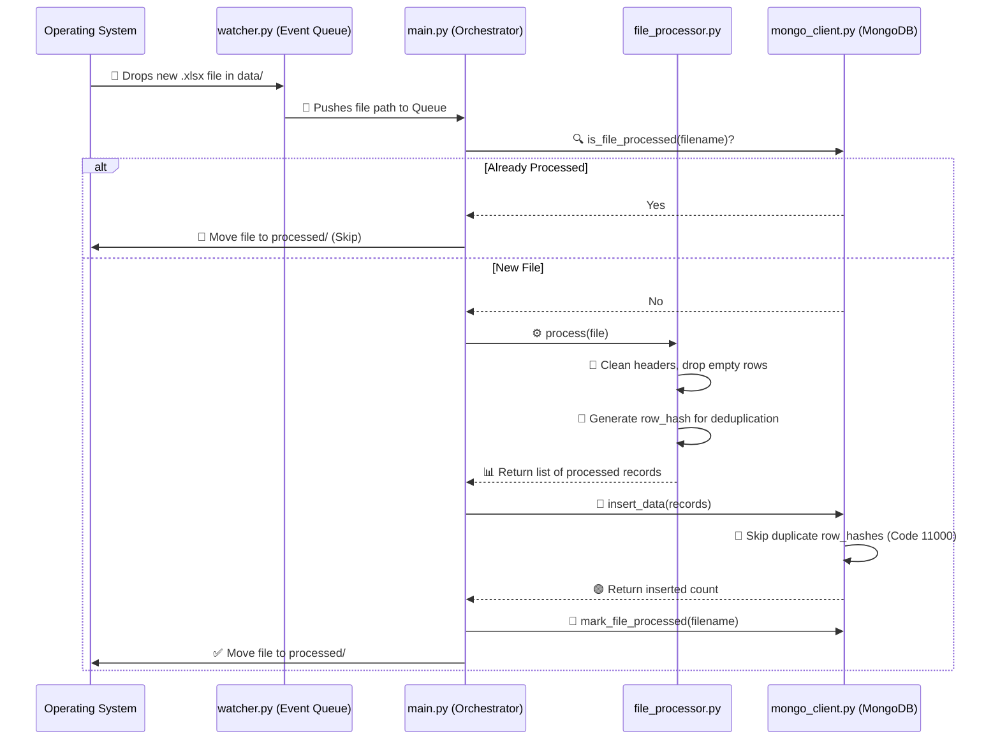
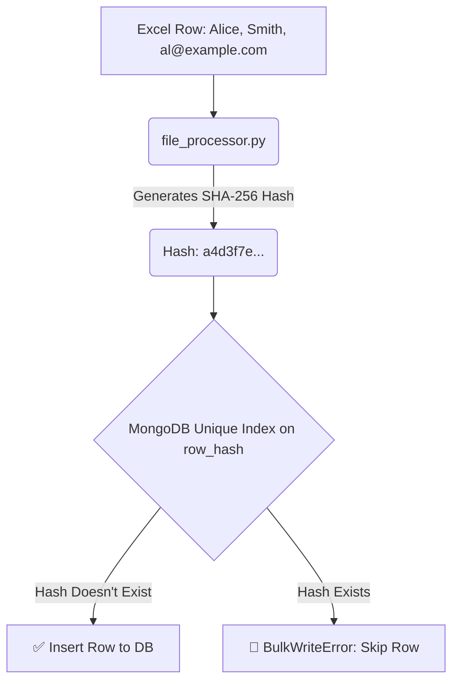

# 📂 Python Scheduler - Modular File Ingestion System

A robust, production-ready system that monitors a directory for Excel files, processes their contents, and intelligently inserts the data into MongoDB while ensuring absolutely **zero duplicates**.

---

## 🏗️ System Architecture & Data Flow

Here is a high-level overview of how the system operates from the moment a file is dropped into the folder.



---

## 🧩 File-by-File Breakdown

The project is structured into modular components, making it highly maintainable. Here is what every file does:

### 1. `main.py` (The Orchestrator)
**Role:** The brain of the application. It connects all the pieces together.
- It initializes the `FolderWatcher`, `FileProcessor`, and `MongoDBClient`.
- It continuously listens to the watcher's queue for new files.
- It coordinates the workflow: Check if file was processed -> Parse file -> Save to DB -> Mark as processed -> Move the file to `processed/` (or `failed/` if an error occurs).
- It handles graceful shutdowns (listening for `Ctrl+C` to stop watching safely).

### 2. `scheduler/watcher.py` (The Eyes)
**Role:** Actively monitors the directory.
- Uses the `watchdog` library to hook into OS file-system events.
- Watches the `data/` folder (defined in `config.py`) for any `.xlsx` or `.xls` files.
- Ignores temporary/hidden files (like `~$filename.xlsx`).
- When a valid file is detected, it places the file path into a Queue for `main.py` to pick up.

### 3. `services/file_processor.py` (The Data Engine)
**Role:** Parses and cleans the Excel data.
- Uses `pandas` and `openpyxl` to read **all sheets** within the Excel workbook.
- Drops completely empty rows to prevent blank data in the database.
- Normalizes column headers: formats them to lowercase, strips trailing spaces, and replaces inner spaces with underscores (e.g., ` First Name ` becomes `first_name`).
- Appends crucial metadata to every row: `source_file`, `sheet_name`, and `processed_timestamp`.
- **Generates a `row_hash`**: Creates a SHA-256 hash representing the exact content of the row. This hash is vital for our database-level deduplication.

### 4. `db/mongo_client.py` (The Vault)
**Role:** Handles all interactions with MongoDB securely.
- Connects to the database and ensures **Unique Indexes** are created for `row_hash` (in the data collection) and `source_file` (in the processed files collection).
- Performs bulk inserts using `insert_many(ordered=False)`.
- **Graceful Error Handling:** If a duplicate `row_hash` is found, MongoDB throws a `BulkWriteError` (Code 11000). The client catches this, ignores the duplicates, and perfectly inserts all the new rows.
- Has an exponential backoff mechanism in case the database connection briefly drops.

### 5. `config.py` & `.env` (The Settings)
**Role:** Centralizes environment variables.
- Uses `python-dotenv` to load configurations like `MONGO_URI`, `DB_NAME`, and folder paths (`data/`, `processed/`, `failed/`) from the `.env` file, ensuring no hardcoded secrets inside the source code.

### 6. `utils/logger.py` (The Reporter)
**Role:** Provides a unified logging mechanism.
- Configures standard output logging with timestamps, ensuring all steps (infos, warnings, and errors) are uniform and easy to trace in your terminal.

---

## 💾 How Data Gets Saved & Deduplicated

The deduplication process is bulletproof and works on two levels: **File-Level** and **Row-Level**.



### The Two-Tier Strategy:
1. **File-Level (`processed_files` collection):** 
   Once a file (e.g., `September_Data.xlsx`) is successfully processed, its exact name is recorded in a separate `processed_files` collection. If a file with the exact same name is dropped again, `main.py` skips it immediately.
2. **Row-Level (`row_hash` Unique Index):** 
   If a new file accidentally contains rows that were already ingested before, the system will generate identical SHA-256 hashes for those rows. When attempting to insert the data into MongoDB, the unique database index on `row_hash` perfectly blocks those duplicates while seamlessly inserting the fresh data. No database clutter!

---

## 🚀 Setup & Execution

### 1. Requirements
Ensure you have Python 3.8+ installed.

### 2. Install Dependencies
```bash
pip install -r requirements.txt
```
*(Make sure to use a virtual environment like `venv`!)*

### 3. Environment Variables
Create or update your `.env` file with your Mongo URI:
```env
MONGO_URI=mongodb://localhost:27017
DB_NAME=file_ingestion
COLLECTION_NAME=records
WATCH_FOLDER=data/
PROCESSED_FOLDER=processed/
FAILED_FOLDER=failed/
POLL_INTERVAL=5
```

### 4. Start the Service
```bash
python main.py
```
*The system will create the `data/`, `processed/`, and `failed/` folders automatically. Drop an Excel file into `data/` to watch the magic happen!*
